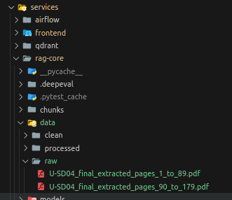
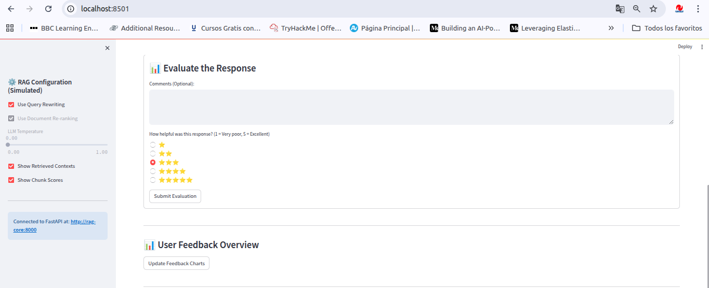

# Tutorial del Proyecto RAG

¡Bienvenido al tutorial del proyecto! Este documento te guiará paso a paso sobre cómo interactuar con el sistema una vez que hayas clonado el repositorio y lo hayas configurado localmente.

## Prerrequisitos

Antes de comenzar, asegúrate de haber seguido las instrucciones del archivo `README.md` para clonar el repositorio, instalar dependencias y levantar los servicios necesarios (Airflow, Streamlit, etc.).

---

## Paso 1: Verificación de Archivos

Antes de iniciar el flujo de trabajo, verifica que los archivos PDF necesarios estén presentes en la ubicación correcta.

### Acción:
1. Navega a la carpeta `service/rag-core/data/raw/`.
2. Confirma que los archivos PDF requeridos se encuentren dentro de esta carpeta.

### Visualización:

> *Captura de pantalla de la carpeta `service/rag-core/data/raw/` mostrando los archivos PDF.*

---

## Paso 2: Lanzamiento del DAG

El sistema utiliza Apache Airflow para orquestar la ingesta de documentos. Aunque el Dag esta programado para lanzarce semanlmente, para prueba, debes lanzar manualmente el DAG encargado de este proceso.

### Acción:
1. Abre tu navegador y accede a la UI de Airflow: [http://localhost:8080](http://localhost:8080).
2. Inicia sesión con tus credenciales (por defecto `airflow` / `airflow` si no las has cambiado).
3. Busca el DAG `rag_ingestion_api_orchestrator` en la lista.
4. Haz clic en el botón **"Trigger DAG"** (generalmente un icono de rayo ⚡ o un botón de texto).
5. Confirma la acción si es necesario.

### Visualización:

<video src="./images/airflow_inicio.mp4" width="800" height="600" controls></video>
> *Video de la UI de Airflow, resaltando el DAG `rag_ingestion_api_orchestrator`.*

---

## Paso 3: Realización de una Consulta

Una vez que el DAG ha finalizado con éxito, puedes interactuar con la interfaz de preguntas y respuestas basada en los documentos ingeridos.

### Acción:
1. Abre tu navegador y accede a la UI de Streamlit: [http://localhost:8501](http://localhost:8501).
2. Utiliza una pregunta de ejemplo del archivo `questions.json` (por ejemplo, una pregunta clave sobre el contenido de los PDFs).
3. Haz clic en "Enviar".
4. Observa la respuesta generada y la información de trazabilidad asociada.

### Visualización:
<video src="./images/ui_1.mp4" width="800" height="600" controls></video>
> *Captura de pantalla de la UI de Streamlit mostrando una pregunta y la respuesta generada, incluyendo trazabilidad (score, chunk ID, etc.).*

---

## Paso 4: Envío de Evaluación (Feedback)

Después de recibir una respuesta, puedes proporcionar feedback sobre su calidad.

### Acción:
1. En la misma interfaz de Streamlit, busca los controles de feedback un campo de texto para comentarios da tu opinión selecciona la cantidad de estrellas y finalmente pulsa el boton `Submit Evaluation`.
2. Selecciona una opción o escribe tu comentario.
3. Haz clic en "Enviar Feedback".

### Visualización:

> *Captura de pantalla mostrando la confirmación del envío del feedback.*

---

## Paso 5: Visualización del Dashboard de Evaluación

### Acción:
1. Accede a la interfaz del dashboard de evaluación la cual se divide en dos un gráfico que representa las valoraciones en el feedback de los usuarios y un area RAG Evaluation donde se anidan los gráficos que muetran las metricas de las diferentes pruebas de evaluacón (requiere un paso anterior).
2. Observa los gráficos o métricas generadas a partir del feedback recibido.

### Visualización:
<video src="./images/graficos.mp4" width="800" height="600" controls></video>
> *Captura de pantalla de un dashboard simple mostrando gráficos relacionados con la evaluación o feedback.*

---

## ¡Listo!

Has completado el flujo básico del proyecto. Puedes repetir los pasos 3 a 5 para probar más preguntas o evaluar nuevas respuestas.

---

**¿Tienes dudas?** Revisa el `README.md` o abre un *issue* en el repositorio.