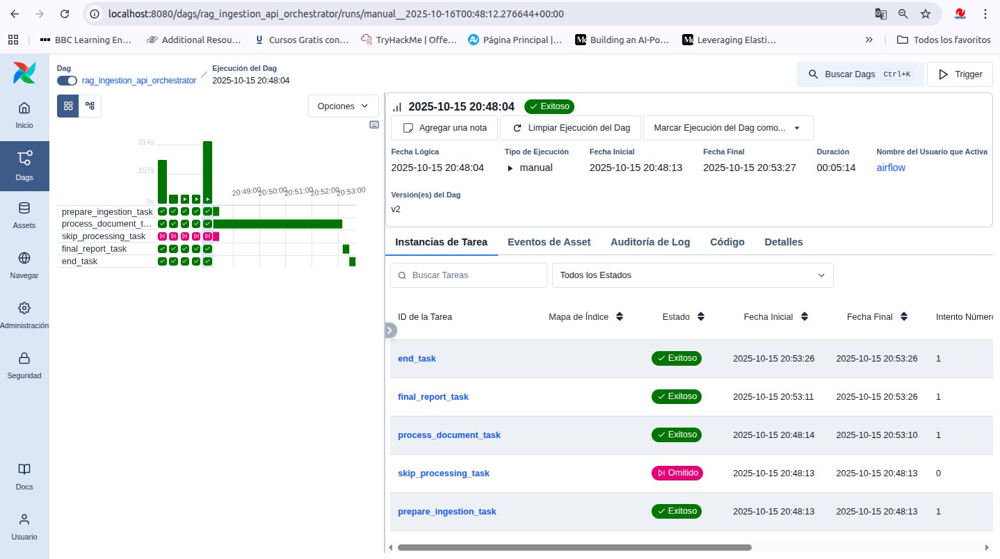
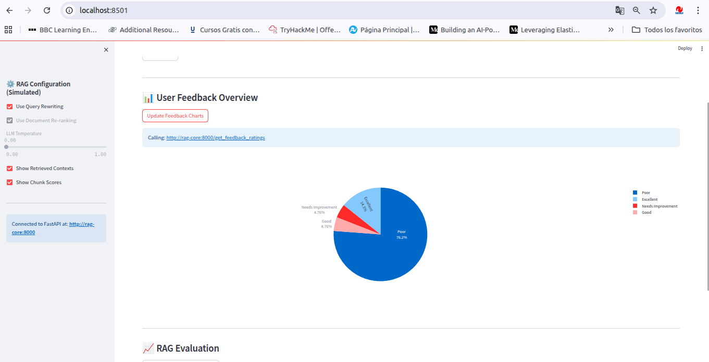
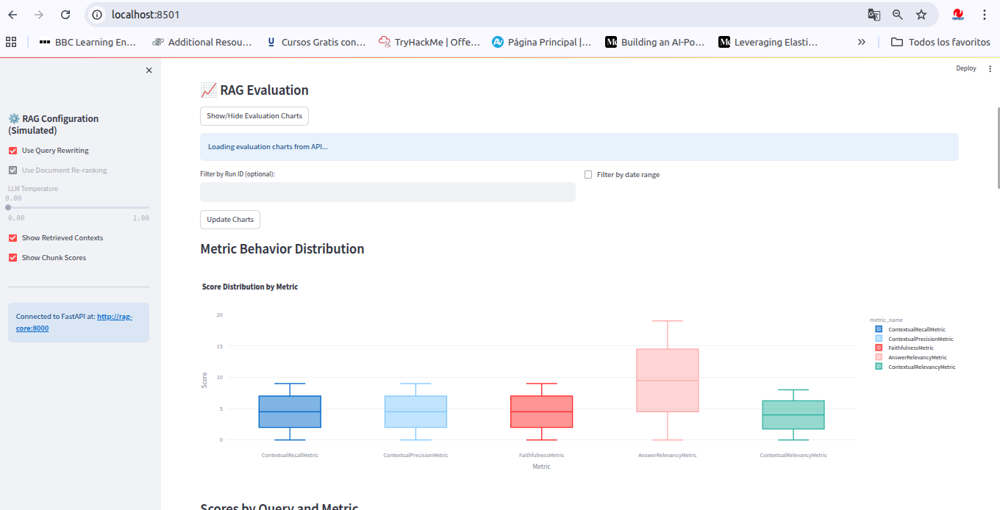

## RAG System Tutorial

This tutorial provides a step-by-step guide on how to run the RAG system and the evaluation suite.

### 1. System Architecture

The system is composed of multiple interconnected services defined in a `docker-compose.yml` file:

*   **`rag-core`:** The core API built with FastAPI. It handles RAG queries, document processing, feedback storage, and evaluation execution.
*   **`rag-frontend`:** The user interface built with Streamlit, allowing users to interact with the RAG system.
*   **`qdrant`:** The vector database used for storing document embeddings.
*   **`postgres`:** The PostgreSQL database for storing feedback and evaluation results.
*   **`airflow`:** Orchestrates the document processing workflow.
*   **`airflow-init`:** An initialization job for Apache Airflow.
*   **`vectorflow`:** A service responsible for ingesting documents into the vector database.
*   **`vectorflow-init`:** An initialization job for VectorFlow.

### 2. Prerequisites

Before starting, ensure you have the following installed on your machine:

*   **Docker:** [Install Docker](https://docs.docker.com/get-docker/)
*   **Docker Compose:** [Install Docker Compose](https://docs.docker.com/compose/install/)

### 3. Configuration

1.  **Copy the environment file:** Create a copy of the `.env.example` file and name it `.env`. This file contains the environment variables required for the services.
    ```bash
    cp .env.example .env
    ```
2.  **Edit the `.env` file:** Open the `.env` file and update the values according to your environment.
    *   **`QDRANT_API_KEY`:** The API key for the Qdrant service (if applicable).
    *   **`POSTGRES_USER`:** The username for the PostgreSQL database.
    *   **`POSTGRES_PASSWORD`:** The password for the PostgreSQL database.
    *   **`POSTGRES_DB`:** The name of the PostgreSQL database.
    *   **`QDRANT_HOST`:** The host address for the Qdrant service (usually `qdrant` when using Docker Compose).
    *   **`POSTGRES_HOST`:** The host address for the PostgreSQL service (usually `postgres` when using Docker Compose).
    *   **`QDRANT_PORT`:** The port number for the Qdrant service (default is `6333`).
    *   **`POSTGRES_PORT`:** The port number for the PostgreSQL service (default is `5432`).
    *   **`QDRANT_COLLECTION_NAME`:** The name of the Qdrant collection where vectors will be stored.
    *   **`VECTORFLOW_API_KEY`:** The API key for the VectorFlow service.
    *   **`VECTORFLOW_URL`:** The URL for the VectorFlow service (usually `http://vectorflow:8000` when using Docker Compose).
    *   **`RAG_CORE_URL`:** The URL for the RAG Core API (usually `http://rag-core:8000` when using Docker Compose).
    *   **`DEEPSEEK_API_KEY`:** The API key for the DeepSeek LLM provider.
    *   **`QWEN_API_KEY`:** The API key for the Qwen LLM provider.
    *   **`GEMINI_API_KEY`:** The API key for the Gemini LLM provider.
    *   **`OPENAI_API_KEY`:** The API key for the OpenAI LLM provider (if used).
    *   **`EVALUATION_MODELS`:** A comma-separated list of models to be used during evaluation (e.g., `deepseek-chat,qwen-api,gemini-api`).
    *   **`RAG_CORE_API_KEY`:** The API key for the RAG Core API (if authentication is required).

### 4. Running the System

1.  **Start the services:** Run the following command to start all the services defined in the `docker-compose.yml` file.
    ```bash
    docker-compose up -d
    ```
    The `-d` flag runs the services in the background.
2.  **Wait for services to be ready:** It may take a few minutes for all services to start up completely. Pay attention to the logs, especially for `airflow-init` and `vectorflow-init`, to ensure they complete successfully.
3.  **Access the applications:**
    *   **Frontend:** Open your browser and navigate to `http://localhost:8501` to access the RAG system user interface.
    *   **RAG Core API:** The API endpoints are available at `http://localhost:8000`. You can check the `/docs` endpoint for the interactive API documentation.
    *   **Airflow:** Access the Airflow UI at `http://localhost:8080`.

### 5. Running the Evaluation Suite

The evaluation suite is integrated into the `rag-core` service. It can be triggered manually via its API endpoint or automatically by a scheduled Airflow job.

#### Manual Execution via API:

1.  **Prepare the request body:** The request body for the `/run_evaluation_suite` endpoint is a JSON object containing the following parameters:
    *   `evaluation_data`: An array of objects, each representing a data point for evaluation. Each object should contain:
        *   `query_text` (string): The input question for the RAG system.
        *   `expected_output` (string): The expected or ground truth answer (optional for some metrics).
        *   `context` (string): The relevant context snippet from the knowledge base (optional for some metrics).
        *   `feedback_id` (string, optional): An associated feedback ID, if applicable.
    *   `evaluation_models` (array of strings): A list of model names (defined in your environment variables) to be used for evaluation (e.g., `["deepseek-chat", "qwen-api"]`).
    *   `evaluation_suite_name` (string): A name for the evaluation run (e.g., `rag_evaluation_weekly`).

    **Example Request Body:**
    ```json
    {
      "evaluation_data": [
        {
          "query_text": "What are the prerequisites for the course?",
          "expected_output": "Basic knowledge of Python and SQL is recommended.",
          "context": "Prerequisites: Familiarity with Python programming and SQL queries.",
          "feedback_id": "feedback_001"
        },
        {
          "query_text": "How long is the course?",
          "expected_output": "The course duration is approximately 3 months.",
          "context": "Course Duration: 12 weeks, approximately 3 months.",
          "feedback_id": "feedback_002"
        }
      ],
      "evaluation_models": ["deepseek-chat", "qwen-api"],
      "evaluation_suite_name": "rag_evaluation_weekly"
    }
    ```

2.  **Make the API call:** Send a `POST` request to the `rag-core` API endpoint `/run_evaluation_suite`.
    ```bash
    curl -X POST http://localhost:8000/run_evaluation_suite \
         -H "Content-Type: application/json" \
         -H "X-API-Key: YOUR_RAG_CORE_API_KEY" \
         -d '{
               "evaluation_data": [
                 {
                   "query_text": "What are the prerequisites for the course?",
                   "expected_output": "Basic knowledge of Python and SQL is recommended.",
                   "context": "Prerequisites: Familiarity with Python programming and SQL queries.",
                   "feedback_id": "feedback_001"
                 }
               ],
               "evaluation_models": ["deepseek-chat"],
               "evaluation_suite_name": "rag_evaluation_weekly"
             }'
    ```
    Replace `YOUR_RAG_CORE_API_KEY` with the actual API key configured for `rag-core`.

3.  **Check the results:** The evaluation results will be stored in the PostgreSQL database (`evaluation_results` table). You can query the database directly or use the frontend application to visualize the results. The `/get_evaluation_results` endpoint in `rag-core` can also be used to fetch the latest results.

#### Scheduled Execution via Airflow:

1.  **Access Airflow UI:** Go to `http://localhost:8080`.
2.  **Find the DAG:** Look for the DAG named `rag_evaluation_weekly`.
3.  **Enable and Trigger:** Enable the DAG if it's not already active. You can manually trigger it using the "Trigger DAG" button, or wait for it to run according to its configured schedule (e.g., weekly).
4.  **Monitor:** Use the Airflow UI to monitor the progress of the evaluation tasks within the DAG.
5.  **Check Results:** As with the manual run, results will be stored in the `evaluation_results` table in PostgreSQL.

### 6. Stopping the System

To stop all the running services, use the following command:

```bash
docker-compose down
```

This command will stop and remove the containers created by `docker-compose up`.

---

## 📞 Contact

If you have questions, suggestions, or want to collaborate on the project, you can contact the main developer through:

* **Name:** Carlos Villarreal P.
* **Email:** `villarreal.fx@gmail.com`
* **LinkedIn:** [`linkedin.com/in/carlos-villarreal-paredes/`](https://www.linkedin.com/in/carlos-villarreal-paredes/)

# Images

### "Pipeline orchestration example with Airflow PDF files"

<video src="./images/airflow_inicio.mp4" width="800" height="600" controls></video>

### "Example of Chat interaction between question and answer and context chunks"

<video src="./images/ui_1.mp4" width="800" height="600" controls></video>

### "Feedback Submission Confirmation"


### "Example of pipeline inyection flow full"

<video src="./images/airflow_inicio.mp4" width="800" height="600" controls></video>

### "Feedback Voting Comparison" && "RAG Evaluation"


<video src="./images/airflow_inicio.mp4" width="800" height="600" controls></video>